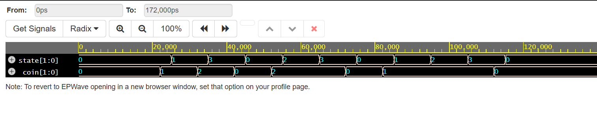
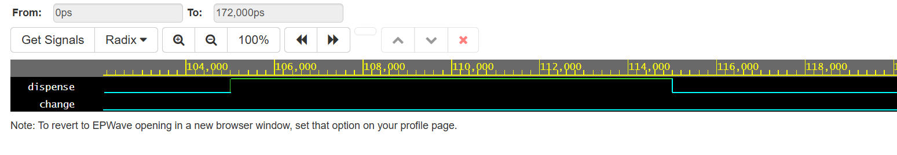
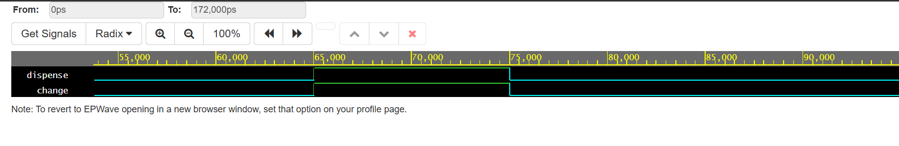

# FSM-Based Vending Machine Controller in Verilog

This project implements a finite state machine (FSM)-based vending machine controller in Verilog. The controller accepts 5-unit and 10-unit coin inputs, dispenses a product when the total reaches the required amount, and returns change in the overpayment case.

## Project Overview

The vending machine sells a product priced at 15 units.

Accepted coin inputs:
- `01` = 5
- `10` = 10
- `00` = no coin

Supported behaviors:
- 5 + 10 -> dispense
- 10 + 5 -> dispense
- 10 + 10 -> dispense + return change
- 5 + 5 + 5 -> dispense

## Features

- FSM-based control design
- Four states representing accumulated payment
- Product dispense logic
- Change return logic for overpayment
- Reset handling
- Waveform-based verification
- Registered overpayment flag for robust hardware behavior

## State Definition

- `S0`  -> 0 inserted
- `S5`  -> 5 inserted
- `S10` -> 10 inserted
- `S15` -> dispense state

## Design Files

- `src/vending_machine.v` — vending machine controller
- `tb/vending_machine_tb.v` — testbench

## Inputs and Outputs

### Inputs
- `clk` — clock
- `rst` — reset
- `coin[1:0]` — coin input

### Outputs
- `dispense` — asserted when product is dispensed
- `change` — asserted when change must be returned

## Design Notes

A registered `overpaid` flag is used to remember whether the machine reached the dispense state through an overpayment case (`10 + 10`). This is more reliable than checking the live coin input during the dispense state.

## Verification Scenarios

The testbench verifies:

- reset behavior
- exact payment: 5 + 10
- overpayment: 10 + 10
- exact payment: 5 + 5 + 5
- idle / no coin behavior

## Waveform Results

### State Transition

### Exact Payment

### Overpayment with Change

## How to Run

### EDA Playground
1. Open EDA Playground
2. Select `SystemVerilog/Verilog`
3. Select `Icarus Verilog 12.0`
4. Paste `vending_machine.v` into the design panel
5. Paste `vending_machine_tb.v` into the testbench panel
6. Enable waveform viewing
7. Run simulation

## Expected Behavior

- The FSM advances according to inserted coins
- `dispense` is asserted when the total reaches or exceeds 15
- `change` is asserted only in the `10 + 10` case
